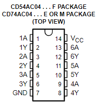
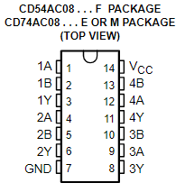
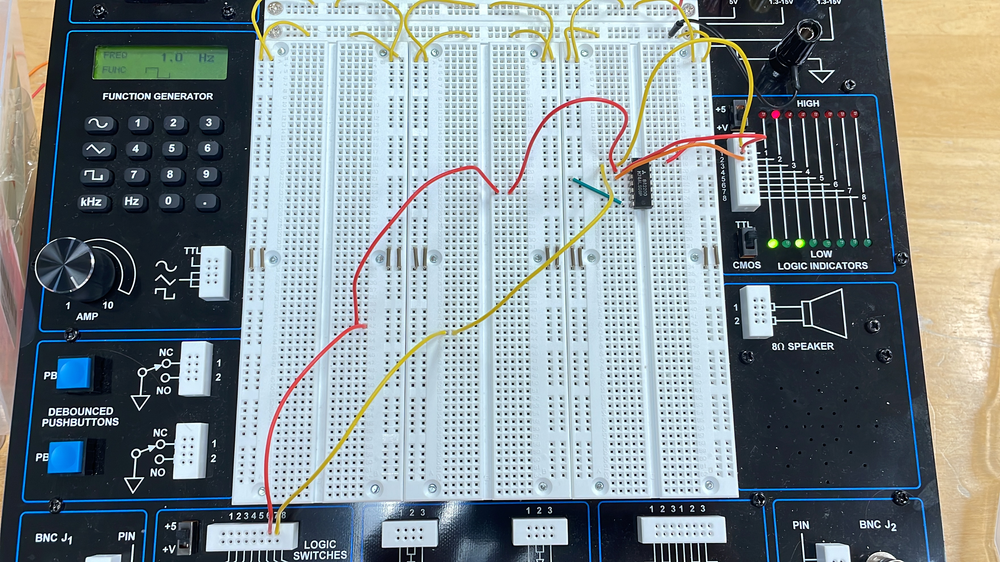

# Lab 1: Let's learn some hardware with PB-503 and Arduino

# Overview and Motivation
Welcome to the Lab 01 of CS281: Introduction to Computer Systems! 
This lab serves as your gateway into the world of hardware and embedded systems. The lab will take you through the intricacies of the PB-503 breadboard prototyping stations and the Arduino microcontroller system. By the end of this lab, you'll be adept at working with essential circuit components like LEDs, resistors, and logic gates, and you'll understand how to interpret IC data sheets—an invaluable skill in the realm of computer systems.


# Objectives of the Lab
1. Familiarize yourself with the PB-503 breadboard and Arduino microcontroller.
2. Understand and construct basic circuits using LEDs, resistors, and integrated circuit chips.
3. Develop the ability to read and interpret IC data sheets.
4. Gain hands-on experience in controlling circuits with the Arduino.
 
# Materials
- PB-503 breadboard prototyping station (integrated device with a number of electrical components like switches)
- Arduino kit
- LEDs
- 330 Ohm resistors
- Logic probes
- 7404 NOT gate IC
- 7408 AND gate IC
- Wires
- Arduino controller and USB cable


# Breadboard Basics
## Project Step
### Step 1 - Explore PB-503:
Look for the integrated components like switches, LEDs, power supplies, and the function generator.


### Step 2 - Powering the Breadboard: 
Learn to power up the breadboard correctly, focusing on the +5 Volts power supply and the Ground connection. 
Firstly, you need to connect the red wire from the power supply to the top row and the black wire from the ground to the top second row of the breadboard.
#### Note: DO NOT hook a wire to any of the other voltages since the circuits we use all run on 5 volts.
#### Note : Always turn off the breadboard power when you are now

### Step 3 - Using Logic Indicators: 
eight of them on the right-hand side, and you can use them to determine HIGH or LOW voltage from a location on the breadboard by connecting a wire from the location of interest to one of the eight Logic Indicators. Get a long single wire that is long enough to stretch across the board.
Use the  Logic Indicators (eight of them on the right-hand side) to determine HIGH or LOW voltage from a location on the breadboard by connecting a wire and understand the voltage levels at different points on the breadboard. Through this step you can verify your circuit connections for the rows and colums.<br />
<br />
#### Note : The double check your connections against your circuit diagram before turning the power on.
<br />

High:


<br />
<br />

Ground:


### What We Learned: 
We found out that the top rows are connected to each other horizontally and all the holes in the top row are connected to +5 voltage, and all the holes in the bottom row are connected to the ground. <br />
We verified this by wiring the holes into Logic Indicators so that the top red LED lights up when it is connected to +5 voltage and the bottom green LED lights up when it is connected to the ground.


# Let's Build LED Circuits

## What you need?
- LEDs
- 330 Ohm resistors
## Project Step

### Step 1 - Wiring: 
Wire the 330 Ohm resistors to the GND same row as the short side of the LED, and wire 5v+ power and the long side of the LED on the same row. It should look like a picture below. <br />
If the LED lights up, you are good to go!
#### Note : The “long” side of the LED must be connected to the +5V and the short side to the GND side.


### Step 2 - Connect to Function Generator: 
If you look at the left side of the board, you will see the "Function Generator" with buttons, knobs or sliders. <br />
Now you will follow the below procedures: <br />
<br />
**(1) Set the switch to a square wave. <br />**
**(2) Set the top switch to “1”. <br />**
**(3) Set the other top switch to Hz (not KHz). <br />**
**(4) Set the left slider to 1.0; this slider can slow the selected frequency by fractions. <br />**
**(5) Set the right slider to its top setting; this slider can be used to select part of the max voltage (afraction of +5V). <br />**
**(6) Use your long wire and connect one end to one of the six non-TTL pins below the function generator. Connect the other end as the high (+5) connection to your LED circuit. <br />**

Now if you turn on the function generator, you will see the LED light blinking.<br />
#### Note: If you change the AMP, you can change the rate of blinking of LED!
#### Fun Fact: One hertz is equal to one cycle per second.
https://github.com/mlcourses/lab-1-blog-post-group2_cs281/assets/108073642/c98ea01f-0c8b-464a-afd8-0b9fb1a6280f


### Step 3 - Check Phase Transition :
If you change the Function Generator to produce different wave, such as "smooth" or "sharp" wave, you will see the differece in how the LED light changes. <br />

https://github.com/mlcourses/lab-1-blog-post-group2_cs281/assets/108073642/ceac7c0d-eb9d-4087-b557-7fd759e6b5fb


https://github.com/mlcourses/lab-1-blog-post-group2_cs281/assets/108073642/681af5ed-7562-41e6-b547-a7fdc48c8f91


# Working with the Arduino
## What you need
- Arduino Kit
- Laptop with Arduino software
### Step 1 - Understanding the Arduino

For this portion of the lab, it is helpful to first understand what an Arduino is. An Arduino board is an embedded controller that we can use to specify what we would like our circuit to do, as well as let the circuit operate independently. Basically, we are giving the circuit a set of tasks to do autonomously.

### Step 2 - Setting up the Arduino
- To make use of the Arduino and give it instructions, we used the Arduino IDE (integrated development environment). Here is the link to download that: http://www.arduino.cc/en/software.
- Once you have become familiar with the software, use this code as instructions for the circuit:

```C++
const int P = 13;
const int A = 1000;
const int B = 1000;

void setup() {
  // put your setup code here, to run once:
  pinMode(P, OUTPUT);
}

void loop() {
  // put your main code here, to run repeatedly:
  digitalWrite(P, HIGH);
  delay(A);
  digitalWrite(P, LOW);
  delay(B);
}
```
- This may look daunting if you have never worked with code before, but its simple, we promise.
- Let us break it down for you. The very first line creates a variable, P, that will represent connection hole 13 on the Arduino board. Note that if you change which hole you are connecting to the Arduino, you must change it to the respective number in this code.
- The next two lines represent 1000 milliseconds (1 second) that we will use as a delay.
- Next, we have two functions: the setup function and the loop function. When an Arduino program is run, it first runs the setup then the loop function infinitely.
- To get the code to work on your Arduino, you must first "verify" your code by clicking the checkmark in the top left corner of the page. After that you can click the arrow that is directly next to it to upload your code to the Arduino. After doing this, your Arduino can operate independently from your laptop, as long as it has a power source.

### Step 3 - Wiring the Arduino
- Now that we have the Arduino set up, we can start by wiring pin 13 of the Arduino to the first pin of the AND gate. When doing this, make sure you remove the previous wire from that pin and leave the second input as is.
- Next, we want to wire the GND from the breadboard to the Arduino. You may use any of the GND pins on the Arduino. It is necessary to do this in order to make sure that the voltage for the Arduino is the same as the breadboard.
- After this, make sure the second switch is set to high. See what happens. You can see the output we got in the videos below and see if you matched ours. Once you've done this, feel free to mess with values A and B in the Arduino program to change the delay. 


https://github.com/mlcourses/lab-1-blog-post-group2_cs281/assets/108073642/a9e87d59-3304-45e1-a5b3-8f9dd710418b


https://github.com/mlcourses/lab-1-blog-post-group2_cs281/assets/108073642/76b03ca5-80cc-4fa0-89e9-a5fbb10300ee
- In this video, we connected it to an AND gate and then to the logic indicator in order to check and experiment with the AND gate.


# Working with logic gates
This part of the lab will be working with the AND and NOT logic gates.
## What you need
- 7404 NOT gate IC
- 7408 AND gate IC
### Not Gate
The purpose of the NOT logic gate is to invert a high signal to low or a low signal to high. The 7404 NOT gate IC can be used to demonstrate a not gate. The schmatic for the 7404 is shown below.
 <br />
To use it have the Vcc pin wired to a 5v power source and the GND pin wired to ground. There are six input pins and six output pins with each pair being denoted with a number, input pins having an A, and output pins having a Y. 
## Project Step - Oscillating NOT circuit
### Step 1: Set up NOT gate
-Have the 7404 IC in the breadboard. 
-We wire the Vcc to the 5v power supply and the GND to ground. 
### Step 2: Plug in inputs
-Then wire the function generator to one of your input pins.
-Wire one of the logic indicators to the input pin and function generator aswell. 
-Then wire the corrosponding output pin to another logic indicator.
### Step 3: Set function generator
-Set up the function generator that was used in the LED circuits. 
-Typically 1Hz on the squared wave works best.
<br /><br />

If everything is set up correctly you should see the two logic indicators that are wired up, one be high and the other low, and then switch back from high and low.


https://github.com/mlcourses/lab-1-blog-post-group2_cs281/assets/157081107/55108ece-2b02-4702-ae69-4a0e62c98a0a


https://github.com/mlcourses/lab-1-blog-post-group2_cs281/assets/157081107/ba56f936-c639-4b2a-9f04-16cb46f8db3a


### And Gate
The purpose of the AND logic gate is to take two inputs and give an high output only if both inputs are high and low otherwise. We are using the 7408 AND gate IC which is wired similarly to the 7404.
 <br />
The Vcc and GND pins and the same on both IC chips. The 7408 only has 4 possible AND gates each one with two inputs denoted with A and B with each corrosponding output having the same number and Y.
## Project Step - AND gate switch circuit
### Step 1: Set up AND gate
-Have the 7408 IC in the breadboard. 
-We wire the Vcc to the 5v power supply and the GND to ground. 
### Step 2: Plug into Logic switches
Near the bottom of the bread board there is a series of switches called "Logic Switches." These will be used to toggle the inputs into our AND gate.
-Wire one logic switchs an input of the IC chip and another switch to the corrosponding input.
-Then, wire the corrosponding output switch to one of the logic indicators. 
<br />
You can turn the logic switches on and off, the output should be low except for when both switches are on high.





## Conclusion

This initial laboratory session establishes groundwork for comprehending the hardware elements and principles fundamental to computer systems that is necessary for CS 281. <br />
The getting interaction with breadboards, examining power supply connections, and wiring allow student to get more familiar with computer system from very low-level.  <br />
Overall, it provided the insights into the functionality of electronic components such as LEDs, function generators, and logic gates. 
 <br />
 The incorporation of Arduino controllers allow students to connect manual circuit control with electronic operation.


